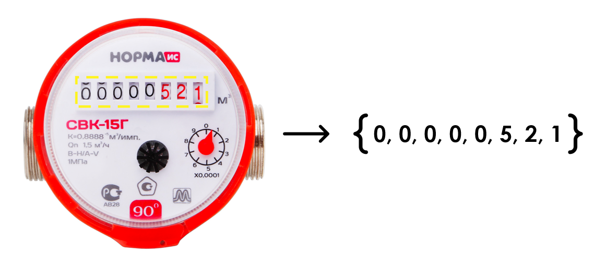
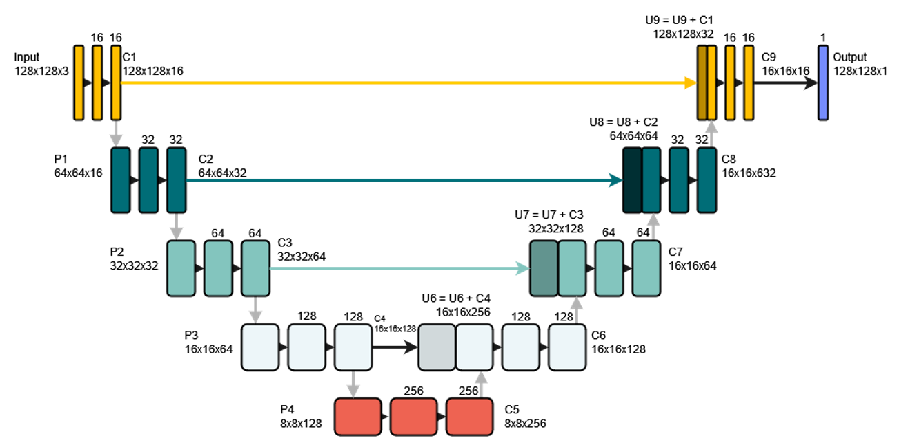
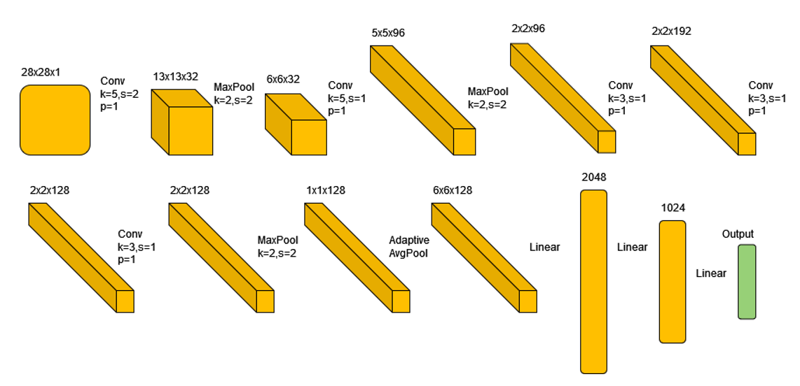
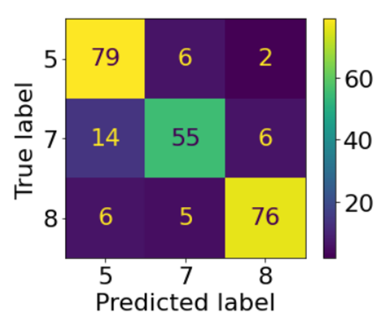
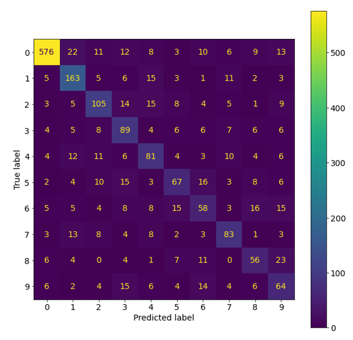

# toloka-water-meters
## Задача
Есть фотографии счётчиков, сделанные работниками Толоки, необходимо по фотографиям получить показания счётчиков.

## Данные
В датасете, предоставленным Толокой, было 1244 изображения с масками и показаниями счётчиков.

## Решение
Решение задачи разделено на три этапа:
- Нахождение области табло по изображению счётчика
- Определение количества цифр на счётчике
- Распознавание отдельных цифр

Для первого этапа была использована архитектура U-Net для сегментации, которая дала значение метрики `MIOU = 0.865`.

Для определения количества цифр на счётчике не хватало, собственно, данных по тому, сколько цифр есть на каждом
счётчике, сначала были предприняты попытки использовать подходы с поиском контуров или с вычислением средних
яркостей на каждой вертикали табло, но они давали очень слабые результаты, поэтому было решено использовать
нейросеть для классификации. Были вручную размечены имеющиеся фотографии, причём по итогу оказалось, что 1207
из них имеют 8 цифр, 30 имеют 5 цифр и только 7 имеют 7 цифр. Такой набор данных слишком несбалансирован,
поэтому путём склейки были сгенерированы новые псевдо-табло счётчиков.

За основу архитектуры нейросети была взята AlexNet.

Итоговый результат классификации тестовой выборки следующий:

Последним этапом было распознавание конкретных цифр, для этого была использована предыдущая нейросеть, но обученная
на соответствующем датасете. Датасет, к сожалению, был несбалансирован, так как на счётчиках куда больше нулей,
чем любых других цифр.

## Пример работы

